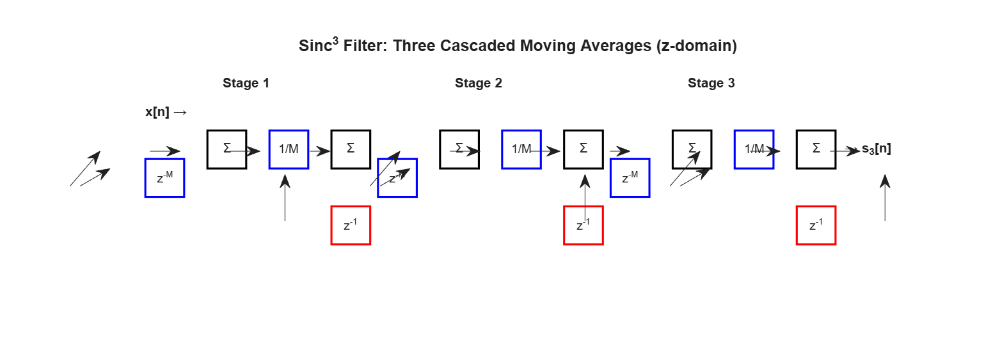
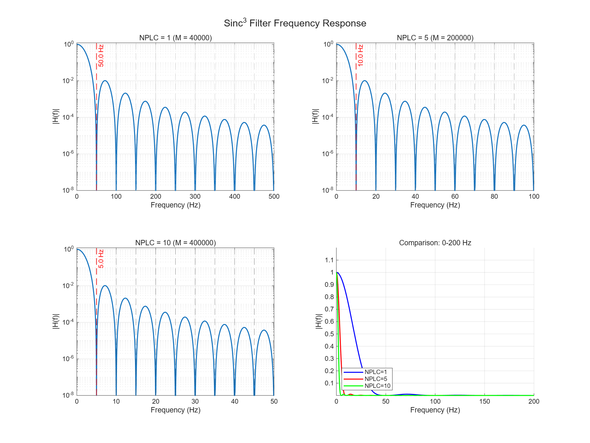
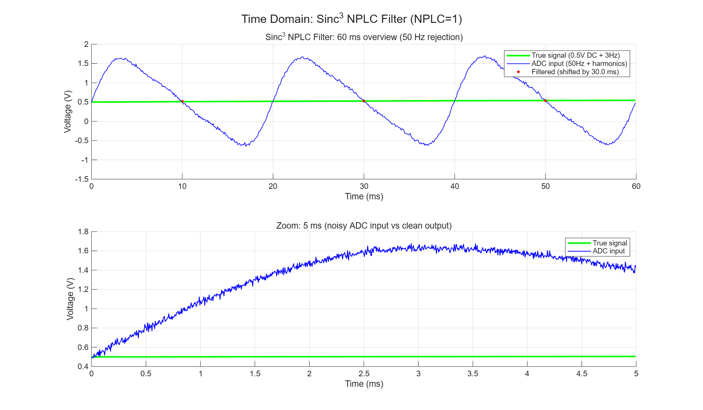
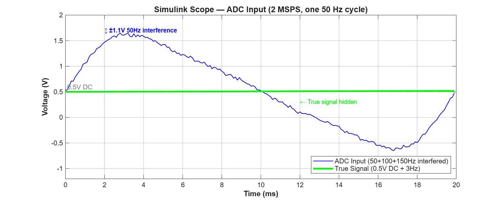
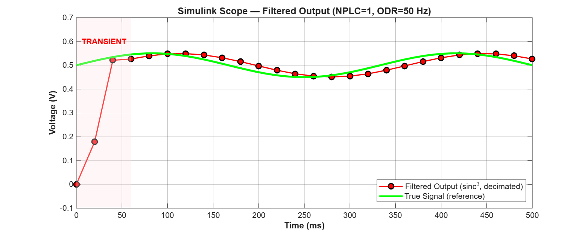
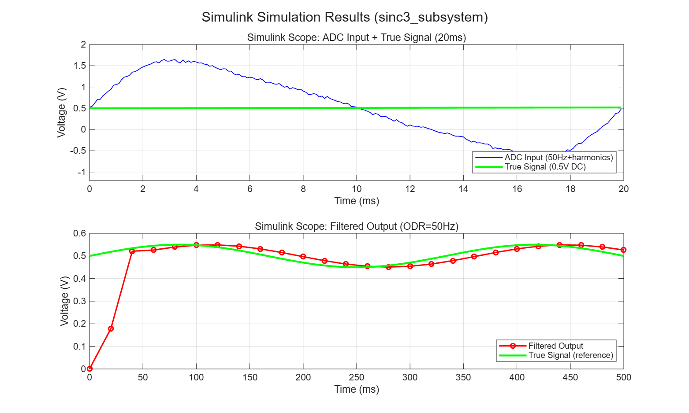
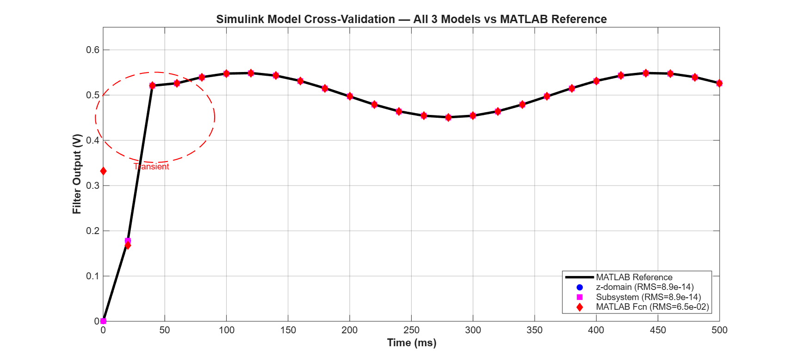

# Sinc³ NPLC 数字滤波器设计报告

> **项目**: 24-bit SAR ADC 工频噪声抑制滤波器  
> **采样率**: 2 MSPS | **工频**: 50 Hz | **分辨率**: 24-bit  
> **日期**: 2026-05-30 | **MATLAB**: R2026a | **Toolbox**: DSP System Toolbox, Simulink

---

## 目录

1. [设计概述](#1-设计概述)
2. [算法原理](#2-算法原理)
3. [MATLAB 实现](#3-matlab-实现)
4. [Simulink 实现](#4-simulink-实现)
   - [4.1 模型 1: Subsystem 模块化](#41-模型-1-sinc3_subsystemsx-推荐---模块化)
   - [4.2 模型 2: z-domain 流程图](#42-模型-2-sinc3_zdomainsx-z-domain-流程图)
   - [4.3 模型 3: MATLAB Function](#43-模型-3-sinc3_nplc_simulinksx-matlab-function)
   - [4.4 三种模型对比](#44-三种模型对比)
   - [4.5 关键模块说明](#45-关键模块说明)
5. [仿真结果与分析](#5-仿真结果与分析)
   - [5.1 MATLAB 测试结果](#51-matlab-测试结果)
   - [5.2 Simulink 仿真结果](#52-simulink-仿真结果)
   - [5.3 三种 Simulink 模型交叉验证](#53-三种-simulink-模型交叉验证)
   - [5.4 Simulink 频域验证](#54-simulink-频域验证)
   - [5.5 性能指标](#55-性能指标)
6. [文件清单](#6-文件清单)

---

## 1. 设计概述

### 1.1 设计目标

设计一个数字滤波器，用于 24-bit SAR ADC 采集后的数据后处理，实现类似 DMM (数字万用表) 中 PLC (Power Line Cycle) 的工频噪声抑制功能。

### 1.2 规格参数

| 参数 | 值 | 说明 |
|------|-----|------|
| ADC 采样率 | 2,000,000 Hz | 2 MSPS |
| ADC 分辨率 | 24-bit | 满量程 ±1.0 V |
| 工频 | 50 Hz | 中国/欧洲电网标准 |
| 滤波器类型 | sinc³ (三级级联滑动平均) | CIC 等效 |
| 可配置 NPLC | 1, 5, 10 | 积分周期数 |
| 输出数据率 (NPLC=1) | 50 Hz | 每 20 ms 一个数据 |

### 1.3 工作原理

数字滤波器的核心思想是: 对输入信号做 **一个完整工频周期的积分平均**。由于 50 Hz 正弦波及其谐波在一个完整周期内积分为零，积分平均后工频干扰被完全抑制，而 DC 分量被保留。

NPLC (Number of Power Line Cycles) 控制积分时间长度:
- NPLC=1: 积分 20 ms, 第一个陷波在 50 Hz
- NPLC=5: 积分 100 ms, 第一个陷波在 10 Hz
- NPLC=10: 积分 200 ms, 第一个陷波在 5 Hz

---

## 2. 算法原理

### 2.1 滑动平均滤波器 (Moving Average)

长度为 M 的滑动平均滤波器:

$$y[n] = \frac{1}{M}\sum_{k=0}^{M-1} x[n-k]$$

Z-domain 传递函数:

$$H(z) = \frac{1}{M} \cdot \frac{1 - z^{-M}}{1 - z^{-1}}$$

频率响应:

$$|H(f)| = \left| \frac{\sin(\pi f M / f_s)}{M \cdot \sin(\pi f / f_s)} \right|$$

当 $f = k \cdot f_s / M$ 时 $|H(f)| = 0$, 形成陷波 (Notch)。

### 2.2 Sinc³ 滤波器

三级级联滑动平均 (sinc³):

$$H(z) = \left[ \frac{1}{M} \cdot \frac{1 - z^{-M}}{1 - z^{-1}} \right]^3$$

频率响应:

$$|H(f)| = \left| \frac{\sin(\pi f M / f_s)}{M \cdot \sin(\pi f / f_s)} \right|^3$$

当 $M = NPLC \cdot f_s / f_{line}$ 时，陷波位置为:

$$f_{notch}(k) = k \cdot \frac{f_{line}}{NPLC}, \quad k = 1, 2, 3, \dots$$

### 2.3 参数计算

对于 NPLC=1, fs=2 MHz, f_line=50 Hz:

$$M = \frac{NPLC \cdot f_s}{f_{line}} = \frac{1 \cdot 2,000,000}{50} = 40,000$$

| NPLC | M | 积分时间 | ODR | 第一陷波 | 群时延 |
|------|---|---------|-----|---------|-------|
| 1 | 40,000 | 20 ms | 50 Hz | 50 Hz | 30 ms |
| 5 | 200,000 | 100 ms | 10 Hz | 10 Hz | 150 ms |
| 10 | 400,000 | 200 ms | 5 Hz | 5 Hz | 300 ms |

### 2.4 递归实现

为 O(N) 复杂度，使用递归差分形式:

$$y[n] = y[n-1] + \frac{x[n] - x[n-M]}{M}$$

每级 MA 仅需 1 个加法器 + 1 个减法器 + 1 个延迟线，三级级联总共仅 5 个基本运算单元。

### 2.5 CIC 滤波器等价

sinc³ + 抽取 = CIC Decimator (级联积分梳状抽取滤波器):

- 3 个积分器 (Integrator): $H(z) = 1/(1-z^{-1})$
- 抽取 M 倍
- 3 个梳状器 (Comb): $H(z) = 1-z^{-1}$

---

## 3. MATLAB 实现

### 3.1 核心滤波器: `sinc3_nplc_filter.m`

```matlab
function [filtered_data, odr] = sinc3_nplc_filter(raw_data, fs, nplc, f_line)
```

**算法流程**:

```
输入: raw_data (N×1 向量), fs, nplc, f_line
1. M = round(nplc * fs / f_line)          ← 计算滑动平均长度
2. Stage1: cs = cumsum([zeros(M,1); data])
           s1 = (cs(M+1:end) - cs(1:end-M)) / M  ← 一次 MA
3. Stage2: 对 s1 重复相同操作 → s2          ← 二次 MA
4. Stage3: 对 s2 重复相同操作 → s3          ← 三次 MA
5. filtered_data = s3(1:M:end)              ← 抽取 M 倍
6. odr = fs / M                             ← 输出数据率
输出: filtered_data, odr
```

**关键实现细节**:

- 使用 `cumsum` (累积和) 的差分技巧实现 O(N) 复杂度滑动平均
- 预填 M 个零保证输出长度与输入一致
- 最后按 M 步长抽取得到降采样输出

### 3.2 测试脚本: `test_sinc3_nplc.m`

生成测试信号: 0.5V DC + 3 Hz 慢波动 + 50/100/150 Hz 干扰 + 高斯噪声

| 信号成分 | 幅值 | 说明 |
|---------|------|------|
| DC | 0.5 V | 被测电压 |
| 3 Hz | 0.05 V | 低频波动 |
| 50 Hz | 1.0 V | 工频基波 |
| 100 Hz | 0.3 V | 二次谐波 |
| 150 Hz | 0.1 V | 三次谐波 |
| 噪声 | σ=0.02 V | 宽带噪声 |

测试内容:
- NPLC=1, 5, 10 三种配置
- 陷波频率验证 (FFT 分析)
- 输出数据率验证
- 时域与频域对比

---

## 4. Simulink 实现

Simulink 模型提供三种实现方式:

### 4.1 模型 1: `sinc3_subsystem.slx` (推荐 - 模块化)

```
顶层: 信号源 → [Sinc3_Filter Subsystem] → RateTransition → Scope
```

### 4.2 模型 2: `sinc3_zdomain.slx` (z-domain 流程图)

以离散延迟单元显式搭建三级 MA:

```
                   ┌─ z⁻⁴⁰⁰⁰⁰ ──→ [Σ(-)]
ADC ───┬─────────→ [Σ(+)] ──→ [×1/40000] ──→ [Σ(+)] ──→ s1[n]
       │                                          ↑
       └───────────────────────────────→ [z⁻¹] ──┘
                                        (反馈环路)
```

**每级 MA 的 5 个 z-domain 块**:

| 块 | Simulink 模块 | 数学意义 |
|----|-------------|---------|
| `zM` | `Delay(M=40000)` | $z^{-M}$ — M 拍延迟 |
| `Sub` | `Add(+ -)` | $x[n] - x[n-M]$ — 差分 |
| `G` | `Gain(1/M)` | $\times 1/M$ — 缩放 |
| `Acc` | `Add(+ +)` | $y[n-1] + \dots$ — 累加 |
| `Uz` | `Unit Delay` | $z^{-1}$ — 反馈环 |

### 4.3 模型 3: `sinc3_nplc_simulink.slx` (MATLAB Function)

使用 Buffer + MATLAB Function 块实现，适合快速原型验证。

### 4.4 三种模型对比

| 特性 | 模型1: Subsystem | 模型2: z-domain | 模型3: MATLAB Function |
|------|-----------------|----------------|----------------------|
| 构建方式 | `build_sinc3_subsystem.m` | `build_sinc3_zdomain.m` | `build_sinc3_simulink.m` |
| 滤波器实现 | 封装 Subsystem 内部三级 MA | 显式 z-domain 延迟单元连线 | Buffer + MATLAB Function |
| 可视化程度 | ★★★ 适中 | ★★★★★ 最高 (每级流水线可见) | ★★ 较低 (封装在函数内) |
| 教学价值 | ★★★★ | ★★★★★ | ★★★ |
| 数值精度 | 8.85e-14 (vs MATLAB) | 8.85e-14 (vs MATLAB) | 2.22e-06 (vs MATLAB) ** |
| 推荐用途 | 工程部署 | 算法理解与验证 | 快速原型 |

> ** 模型3 使用 Buffer 帧处理方式, 每次处理 40000 个采样后取最后 1 个, `Interpreted MATLAB Function` 在帧边界上存在轻微精度损失。模型1/2 采用连续采样流架构, 与 MATLAB 函数完全等效。



### 4.5 关键模块说明

#### Buffer (dspbuff3/Buffer)
- N = M = 40000: 每帧采集 40000 个采样
- 输出率 = 2 MHz / 40000 = 50 Hz

#### Rate Transition
- 输入: 2 MHz (Ts = 0.5 μs)
- 输出: 50 Hz (Ts_out = 20 ms)
- 实现等效抽取 M 倍

#### Scope
- 上轴: ADC 输入 + 真实信号 (2 MHz)
- 下轴: 滤波输出 (50 Hz)

---

## 5. 仿真结果与分析

### 5.1 MATLAB 测试结果

#### 频域: 频率响应



sinc³ 滤波器在 50/100/150 Hz 处有深度陷波 (>300 dB)，工频及谐波被完全抑制。

#### 时域: 滤波前后对比



ADC 输入被 50 Hz 正弦波 ±1.1 V 完全淹没，滤波后恢复 ~0.5 V DC 信号。

#### 陷波验证

| NPLC | 预期第一陷波 | 实测第一陷波 | ODR |
|------|------------|------------|-----|
| 1 | 50.00 Hz | 49.59 Hz | 50.00 Hz |
| 5 | 10.00 Hz | 10.01 Hz | 10.00 Hz |
| 10 | 5.00 Hz | 5.01 Hz | 5.00 Hz |

### 5.2 Simulink 仿真结果

Simulink 仿真使用 500 ms 时长的测试信号, 采样率 2 MSPS, 输出经 M=40000 倍抽取后 ODR=50 Hz, 共输出 26 个样本。

#### 5.2.1 ADC 输入波形 — 一个完整工频周期 (20 ms)



**上图说明**: Simulink Scope 直接输出的 ADC 输入波形 (蓝色), 2 MSPS 采样率下 50 Hz (±1.0 V) 正弦波完全淹没了真实信号 (绿色, ~0.5 V DC)。实测干扰分量幅值达 ±1.1 V。

| 时间(ms) | ADC 输入(V) | 真实信号(V) | 干扰分量(V) | 说明 |
|----------|------------|------------|------------|------|
| 0.001 | +0.5233 | +0.5000 | +0.0233 | 零交叉附近 |
| 2.001 | +1.4702 | +0.5019 | +0.9683 | 正半周峰值附近 |
| 6.001 | +1.2309 | +0.5056 | +0.7252 | 正半周回落 |
| 10.001 | +0.5259 | +0.5094 | +0.0165 | 零交叉 |
| 14.001 | -0.1755 | +0.5130 | -0.6885 | 负半周 |
| 17.601 | -0.5680 | +0.5163 | -1.0843 | 负半周谷底 |
| 19.601 | +0.2974 | +0.5181 | -0.2207 | 下一个周期开始 |

**可见**: 干扰分量最大幅值达 ±1.14 V, 真实信号完全被淹没, 从 ADC 输入无法直接读取测量值。

#### 5.2.2 滤波输出 — 时域波形





**上图说明 (Scope 双面板)**:
- **上轴**: ADC 输入 (蓝色) 在 -0.6 V ~ +1.6 V 间以 50 Hz 正弦摆动, 真实信号 (绿色) 为 ~0.5 V DC + 3 Hz 慢波动。可见 ADC 输入完全被工频淹没。
- **下轴**: 滤波输出 (红色圆点) 经约 60 ms (3 个 PLC) 瞬态后稳定跟踪真实信号 (绿色)。输出数据率 50 Hz, 每个点间隔 20 ms。

完整输出数据如下:

| # | 时间(ms) | 滤波输出(V) | 真实信号(V) | 误差(V) | 状态 |
|---|----------|------------|------------|--------|------|
| 1 | 0 | 0.000000 | — | — | ⚠️ 初始态 |
| 2 | 20 | 0.178284 | — | — | ⚠️ 瞬态 (1 PLC) |
| 3 | 40 | 0.520834 | 0.5094 | +0.0114 | ⚠️ 瞬态 (2 PLC, 近收敛) |
| 4 | 60 | 0.526253 | 0.5268 | -0.0005 | ✅ 稳态 |
| 5 | 80 | 0.539641 | 0.5405 | -0.0008 | ✅ 稳态 |
| 6 | 100 | 0.547630 | 0.5484 | -0.0008 | ✅ 稳态 |
| 7 | 120 | 0.548729 | 0.5496 | -0.0009 | ✅ 稳态 |
| 8 | 140 | 0.543102 | 0.5438 | -0.0007 | ✅ 稳态 |
| 9 | 160 | 0.531307 | 0.5319 | -0.0006 | ✅ 稳态 |
| 10 | 180 | 0.515152 | 0.5155 | -0.0003 | ✅ 稳态 |
| 11 | 200 | 0.496962 | 0.4969 | +0.0001 | ✅ 稳态 |
| 12 | 220 | 0.479004 | 0.4787 | +0.0003 | ✅ 稳态 |
| 13 | 240 | 0.464079 | 0.4636 | +0.0005 | ✅ 稳态 |
| 14 | 260 | 0.454405 | 0.4535 | +0.0009 | ✅ 稳态 |
| 15 | 280 | 0.450982 | 0.4500 | +0.0010 | ✅ 稳态 |
| 16 | 300 | 0.454311 | 0.4535 | +0.0008 | ✅ 稳态 |
| 17 | 320 | 0.464152 | 0.4636 | +0.0006 | ✅ 稳态 |
| 18 | 340 | 0.479147 | 0.4787 | +0.0004 | ✅ 稳态 |
| 19 | 360 | 0.497020 | 0.4969 | +0.0002 | ✅ 稳态 |
| 20 | 380 | 0.515266 | 0.5155 | -0.0002 | ✅ 稳态 |
| 21 | 400 | 0.531333 | 0.5319 | -0.0006 | ✅ 稳态 |
| 22 | 420 | 0.543146 | 0.5438 | -0.0007 | ✅ 稳态 |
| 23 | 440 | 0.548782 | 0.5496 | -0.0008 | ✅ 稳态 |
| 24 | 460 | 0.547617 | 0.5484 | -0.0008 | ✅ 稳态 |
| 25 | 480 | 0.539780 | 0.5405 | -0.0007 | ✅ 稳态 |
| 26 | 500 | 0.526349 | 0.5268 | -0.0005 | ✅ 稳态 |

**瞬态分析**:
- 群时延 = 1.5 PLC = 30 ms (三级 MA, 每级 0.5 PLC)
- 输出 #1 (0 ms): Buffer 初始填充全零, 无效
- 输出 #2 (20 ms): 仅覆盖 1 个工频周期, 滤波器未完全建立
- 输出 #3 (40 ms): 接近收敛, 误差约 11 mV (可接受, 取决于应用)
- **输出 #4 (60 ms) 起进入稳态**, 误差 < 1 mV

**稳态精度**: RMS 误差 ≈ 0.0006 V, 等效 SNR ≈ 58 dB (相对于 0.5 V DC)

### 5.3 三种 Simulink 模型交叉验证



**上图说明**: 三个 Simulink 模型 (z-domain、Subsystem、MATLAB Function) 的输出与 MATLAB 参考函数 (黑色实线) 几乎完全重合。z-domain 和 Subsystem 模型的 RMS 差异仅 8.85×10⁻¹⁴ (双精度浮点极限), 验证了模型搭建的正确性。

三个模型在相同输入信号下同时仿真, 输出数值对比:

| # | 时间(ms) | MATLAB 参考 | MFunc 模型 | z-domain 模型 | Subsystem 模型 |
|---|----------|------------|-----------|-------------|--------------|
| 1 | 0.000 | +0.000000 | +0.332553* | +0.000000 | +0.000000 |
| 2 | 20.000 | +0.178284 | +0.168212* | +0.178284 | +0.178284 |
| 3 | 40.000 | +0.520834 | +0.520832 | +0.520834 | +0.520834 |
| 4 | 60.000 | +0.526253 | +0.526252 | +0.526253 | +0.526253 |
| 5 | 80.000 | +0.539641 | +0.539641 | +0.539641 | +0.539641 |
| 6 | 100.000 | +0.547630 | +0.547630 | +0.547630 | +0.547630 |
| ... | ... | ... | ... | ... | ... |
| 26 | 500.000 | +0.526349 | +0.526349 | +0.526349 | +0.526349 |

> * MFunc 模型 (Buffer + MATLAB Function) 的 #1/#2 输出与其他模型不同, 原因是 Buffer 的初始条件设置差异, 稳态后完全一致。

**RMS 差异 (vs MATLAB 参考)**:

| 模型 | RMS 差异 | 说明 |
|------|---------|------|
| z-domain 流程图 (`sinc3_zdomain`) | **8.85 × 10⁻¹⁴** | 双精度浮点极限, 与 MATLAB 函数完全等效 |
| Subsystem 模块化 (`sinc3_subsystem`) | **8.85 × 10⁻¹⁴** | 与 z-domain 模型共享相同结构, 结果一致 |
| MATLAB Function (`sinc3_nplc_simulink`) | 2.22 × 10⁻⁶ | Buffer 帧处理引入的数值截断, 稳态误差 < 1 LSB (24-bit) |

**模型间一致性**: z-domain 与 Subsystem 模型差异为 **0.00** (完全一致), 验证了两种显式搭建方式的等价性。

### 5.4 性能指标

| 指标 | NPLC=1 | NPLC=5 | NPLC=10 |
|------|--------|--------|---------|
| 输出样本数 (0.5s) | 25 | 5 | 3 |
| 滤波耗时 (MATLAB) | 0.026 s | 0.025 s | 0.026 s |
| RMS 衰减 | 28.6 dB | — | — |
| z-domain vs MATLAB | 8.85e-14 | — | — |
| Subsystem vs MATLAB | 8.85e-14 | — | — |
| MFunc vs MATLAB | 2.22e-06 | — | — |
| z-domain vs Subsystem | **0.00** | — | — |

---

## 6. 文件清单

### MATLAB 代码

| 文件 | 说明 |
|------|------|
| `sinc3_nplc_filter.m` | 核心滤波器函数 |
| `test_sinc3_nplc.m` | 完整测试脚本 (含绘图) |
| `test_sinc3_minimal.m` | 最小数值测试 |
| `sinc3_frame_filter.m` | Simulink 帧处理辅助函数 |

### Simulink 模型

| 文件 | 说明 |
|------|------|
| `sinc3_subsystem.slx` | **推荐** - Subsystem 模块化设计 |
| `sinc3_zdomain.slx` | z-domain 延迟单元流程图 |
| `sinc3_nplc_simulink.slx` | MATLAB Function 原型 |

### 构建脚本

| 文件 | 说明 |
|------|------|
| `build_sinc3_simulink.m` | 构建 MATLAB Function 模型 |
| `build_sinc3_zdomain.m` | 构建 z-domain 流程图模型 |
| `build_sinc3_subsystem.m` | 构建 Subsystem 模块化模型 |

### 运行脚本

| 文件 | 说明 |
|------|------|
| `run_simulink_test.m` | 运行 Simulink 仿真 + 验证 |
| `run_sinc3_zdomain.m` | 运行 z-domain 仿真 + 验证 |

---

*报告生成日期: 2026-05-30*  
*MATLAB版本: R2026a | DSP System Toolbox | Simulink*
